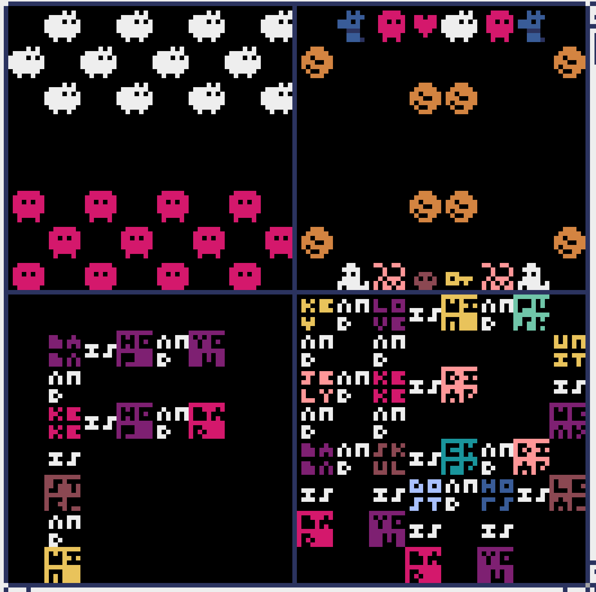
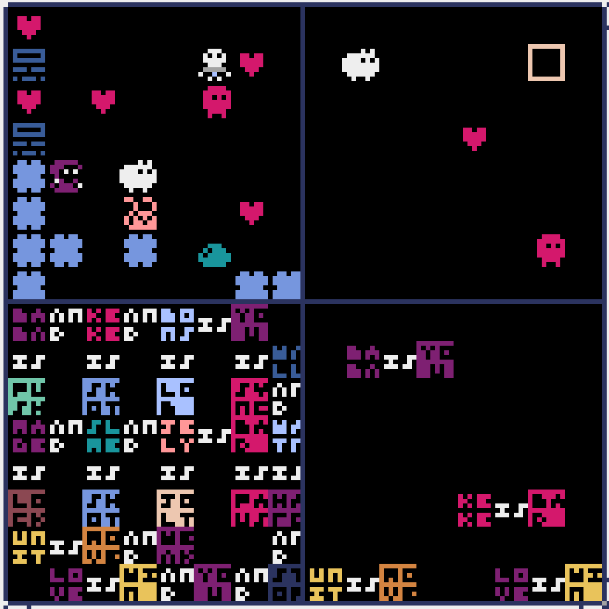

# BABA BOARD GAME

A 2 player board game with BABA IS YOU style rules.

At minimum it should be cool for trying out a bunch of board games, at most it could be an "infinite board game" where you write the rules as you make the rules.

This will have new tiles & rules drop in as you play.
Maybe the goal of the game is to have as many turns as possible before the game locks up in an infinite loop or you loose?

Checkers and basic chess recreated with BABA IS YOU style rules.

An Into-The-Breech style board game and an idea for a starting infinite game.

Play it here: https://kitao.github.io/pyxel/wasm/launcher/?play=Fraser-Greenlee.baba-is-you.baba-board-game&gamepad=enabled
